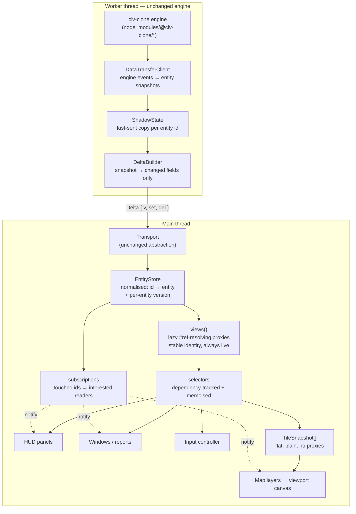

# 02 — Target Architecture

The design being built. Every piece here exists to remove a specific root cause
from [`01-diagnosis.md`](./01-diagnosis.md); none of it is speculative.

## Shape



## The four new ideas

### 1. The store is the wire format

`EntityStore` holds exactly what arrives: `Map<EntityId, Entity>`, where an
`Entity` is the plain object the backend serialised, with its `{ '#ref': id }`
pointers left **in place**. Nothing is resolved on arrival. Applying a delta is
`Object.assign` per changed entity plus a version bump — O(entities changed).

This is what replaces `objectMap` + `reconstituteData`.

### 2. Views resolve references lazily, and are live

`view(id)` returns a `Proxy` that reads through to the store on every property
access and resolves `{ '#ref': id }` values into further views. Three properties
matter:

- **Lazy.** Reading `player.cities[0].name` touches three entities, not the
  whole graph. Nothing is walked that nobody looks at.
- **Stable identity.** `view(id) === view(id)`, forever, because views are
  cached by id alone. This restores `===` comparison between entities, which
  fixes the dead `lastUnit` logic from §Consequence 2 of the diagnosis and makes
  memoisation possible at all.
- **Live.** The proxy has no snapshot; it reads the current entity at access
  time. A component that held a view across a patch sees the new data. That is
  what removes the stale-snapshot hazard that forced `updateState` to stay
  synchronous.

Crucially, **existing component code does not change shape**. Code that reads
`data.player.cities[0].build.available[3].cost.value` keeps working verbatim,
because a view walks exactly like the denormalised object it replaces. That is
what makes Phase 2 a drop-in rather than a rewrite of 90 components.

### 3. Selectors track their own dependencies

Reading through a view records which entity ids were touched. A selector wraps a
function, runs it under that recording, and caches the result along with the
version of every entity it read. On the next call, if no version moved, the
cached value is returned.

```ts
const selectCityYields = createSelector(
  (store, cityId: string) => summariseYields(view(store, cityId).yields),
  (cityId) => cityId
);
```

Dependency tracking gives three things from one mechanism: memoisation,
invalidation, and subscription targets — a component that renders through a
selector automatically knows the exact set of entities it must watch.

### 4. Change notification is a set of ids, delivered in-process

Applying a delta returns the set of touched ids. `Subscriptions.notify(touched)`
wakes only the readers whose dependency sets intersect it. No `document`
dispatch, no `CustomEvent`, no coupling to a DOM. `DataObserver`, `dataupdated`
and `patchdatareceived` all disappear.

## The one place proxies are the wrong tool

The canvas layers read tile data in a tight loop — `Map/Land.ts` alone calls
`world().getNeighbour()` eight times per tile and reads `isLand` on each result.
On an 80×50 world that is 32,000 property reads per full render pass.

Measured, that pass costs **0.57 ms through a flat array and 4.21 ms through
tracked proxies** (see [`03-store-spec.md`](./03-store-spec.md) for the
benchmark). A proxy read is about 6× a plain read — negligible for a panel
reading fifty fields, but not for the one loop that runs twice a second on the
blink tick.

So the map does not read views. A selector builds a **flat plain-object tile
snapshot** once per delta batch, indexed by `y * width + x`:

```ts
export type TileSnapshot = {
  id: string;
  x: number; y: number;
  isLand: boolean; isWater: boolean; isCoast: boolean;
  terrain: string;
  features: string[];
  improvements: string[];
  cityId: string | null;
  goodyHut: string | null;
  workedByCityId: string | null;
  unitIds: string[];
  yields: Array<{ type: string; value: number }>;
};
```

Layers read `TileSnapshot`s: plain objects, no traps, integer-indexed neighbour
lookup instead of a string-keyed `Map`. This also replaces
`src/js/UI/components/World.ts`'s per-flush `rebuildLookup`.

## Directory layout

New code lands in `src/js/UI/State/`. Note the name: `src/js/UI/Store.ts`
**already exists** and is the IndexedDB wrapper used by `AssetStore` — do not
collide with it, and do not rename it.

```
src/js/UI/State/
  types.ts           EntityId, Ref, Entity, Delta
  EntityStore.ts     the normalised map, versions, applyDelta
  tracking.ts        withTracking / track — the dependency recorder
  views.ts           view() proxies, array and nested-object views
  selectors.ts       createSelector, isFresh
  subscriptions.ts   Subscriptions, watch()
  Component.ts       ReactiveComponent base with .use(selector, ...args)
  selectors/
    player.ts        selectPlayer, selectPlayerActions, selectTreasury...
    city.ts          selectCity, selectCityYields, selectCityBuild...
    unit.ts          selectUnits, selectActiveUnitCandidates...
    world.ts         selectTileSnapshots, selectWorldSize
  index.ts           public surface — import from here, not from files
```

Backend additions land in `src/js/Engine/`:

```
src/js/Engine/
  ShadowState.ts     last-sent entity copies, per client
  DeltaBuilder.ts    snapshot → { set, del }; replaces DataQueue's role
  Protocol.ts        Delta types, version constant, validation
```

## Data flow, end to end

**Startup**

1. `frontend.ts` creates the transport and the `EntityStore`, and starts the app.
2. Frontend sends `setOptions` then `start`.
3. Worker builds the game, `DataTransferClient` serialises the initial state,
   `DeltaBuilder` emits a delta with `root` set and every entity in `set`.
4. Frontend applies it. `store.rootId()` is now the `TransferObject` id.
5. Bootstrap builds the HUD, map controller and input controller, each
   subscribing through selectors.

**A player action**

1. Input controller sends `action` over the transport. Nothing local changes —
   the backend remains authoritative.
2. Engine applies it, emits events, `DataTransferClient` re-serialises the
   affected entities, `DeltaBuilder` diffs against `ShadowState` and emits only
   changed fields plus any `del` ids.
3. Frontend `applyDelta` returns the touched id set.
4. `Subscriptions.notify(touched)` wakes exactly the readers that care.
5. Those readers re-run their selectors; unchanged selectors return cached
   values; changed ones produce new output and update their DOM or canvas.

Note what is absent: no graph rebuild, no `document` event, no full re-render,
no reachability sweep.

## What each root cause maps to

| Root cause (from 01) | Removed by |
| -------------------- | ---------- |
| 1 — full denormalisation per flush | `EntityStore` + lazy `view()` |
| 2 — identity destroyed per flush | views cached by id |
| 3 — DOM `CustomEvent` plumbing | `Subscriptions` |
| 4 — monolithic `Renderer.ts` | bootstrap / hud / input / map controller modules |
| 5 — whole-subtree snapshots | `ShadowState` + `DeltaBuilder` |
| 6 — no removes, reachability sweeps | `del` ops in protocol v2 |
| 7 — string-path patch application | field-level `set` keyed by entity id |
| 8 — twelve world canvases | viewport buffers + `TileSnapshot` |
| 9 — unwired `restart` / `quit` | Phase 6 |

## Deliberate non-goals

- **No UI framework.** Decided. The map is canvas, where a framework buys
  nothing; the windows are already built on `@dom111/element`; and fine-grained
  selectors give per-component updates without a VDOM.
- **No engine changes.** `toPlainObject` stays exactly as it is. The backend work
  wraps its output rather than replacing it.
- **No client-side prediction.** The backend stays authoritative. The store is a
  replica, never a source of truth.
- **No immutability requirement.** Entities are mutated in place under version
  bumps. Structural sharing buys nothing here because change detection is by
  version, not by reference equality of containers.
- **Not a real save/load.** The engine has no serialisation of its own and is out
  of scope, so Phase 6 delivers deterministic replay seams rather than a true
  game save. See [`11-phase-6-lifecycle.md`](./11-phase-6-lifecycle.md).
